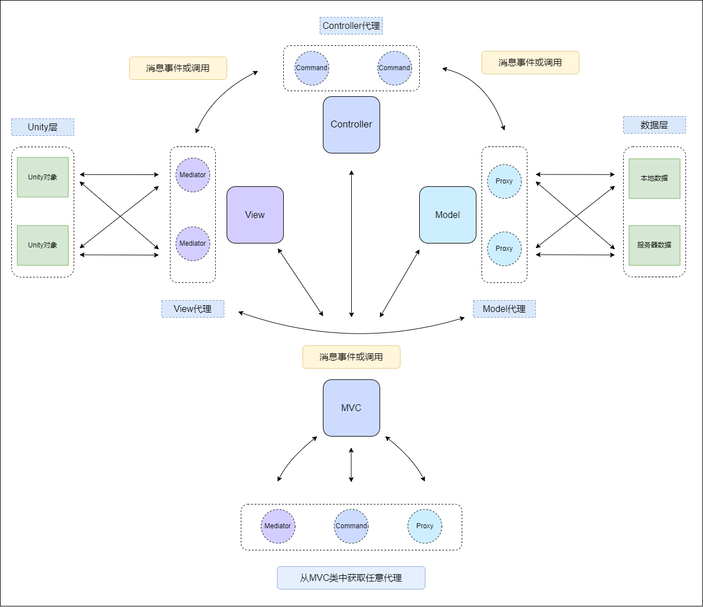

## LiteMVC

- `LiteMVC`是一款轻量级的数据绑定MVC架构，适用于轻量级项目开发。

- 相较于经典的eventName作为key的监听方式，`LiteMVC`采用了数据类型与eventName组合key进行事件监听。
  
- 绑定监听可仅绑定数据类型，亦可同时绑定数据类型与eventName。当数据类型与eventName并存时，则此组合就作为key存在。

- `View`层的代理为`Mediator`，与Unity层进行交互。

- `Controller`层的代理为`Command`，负责无状态的业务逻辑处理。

- `Model`层的代理为`Proxy`，与数据实体进行交互，并承载了与服务器交换数据的职责。

### 架构示意


```
+---LiteMVC          
|   +---Base
|       +---BindKey                     
|       +---IBinder                     
|       +---Pool                        
|   +---Core                            
|       +---Controller                    
|           +---CommandBinder           
|           +---CommandPool            
|           +---Controller             
|           +---ICommand            
|           +---ICommandBinder            
|       +---Notification            
|           +---INotificationBinder             
|           +---Notification             
|           +---NotificationBinder             
|   +---Exts        
|       +---IObservable    
|       +---MVCExts        
|   +---Partten            
|       +---Command                  
|       +---Mediator                 
|       +---Proxy          
|       +---Proxy          
|   +---LiteMVC.asmdef     
```
- 注册`View`层的`Mediator`：MVC.RegisterMediator(new MyMediator());
- 注册`Model`层的`Proxy`：MVC.RegisterProxy(new MyProxy());
- 注册`Controller`层的`Command`: MVC.BindCommand<MyData,MyCommand>();
- 派发消息: MVC.Dispatch(new MyData());
- 实现IObservable接口，可使用MVCExts中的所有扩展方法；